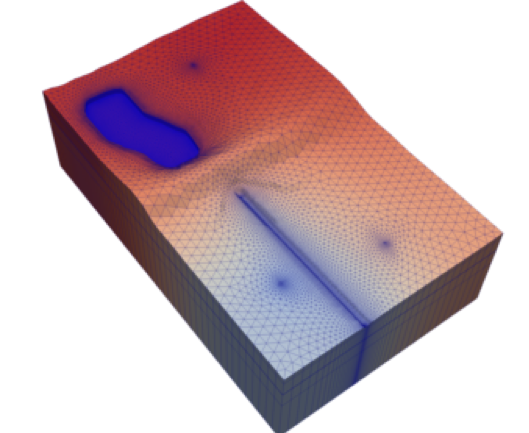

# PNW2023

This repository contains information for a presentation on September 21, 2023, to the PNW Groundwater Modeling Group.

Squeezing Water from a Rock: Unveiling Recent Groundwater Modeling Advances with MODFLOW 6 

Christian Langevin, U.S. Geological Survey

The purpose of this presentation is to summarize new capabilities available in the USGS MODFLOW program.  The latest version of MODFLOW, called MODFLOW 6, is a configurable multi-model hydrologic simulator.  The program currently includes the Groundwater Flow (GWF) Model and the Groundwater Transport (GWT) Model, each based on a comprehensive set of "packages."  The flexible multi-model capability allows users to configure MODFLOW 6 simulations to represent the local-grid refinement (LGR) capabilities available in MODFLOW-LGR, the multi-species transport capabilities in MT3DMS, and the coupled variable-density capabilities available in SEAWAT, for example.  All MODFLOW 6 models and packages are fully supported by the FloPy Python package, which makes it possible to automate model construction and analysis workflows.  The presentation will also touch on some of the new and advanced MODFLOW 6 capabilities, including parallelization of multi-model simulations on laptops, desktops, and supercomputers, and the capability to control and interact with MODFLOW while it is running.   

 

## Software Installation

See software installation instructions [here](./software.md).

## Examples

The presentation consists of a number of MODFLOW 6 examples in which simulations are pre- and post-processed using the Python [FloPy package](https://github.com/modflowpy/flopy).  

* Example 1 -- Regular Grid [notebook](./notebooks/ex1.ipynb)
* Example 2 -- Quadtree Grid [notebook](./notebooks/ex2.ipynb)
* Example 3 -- Local Grid Refinement [notebook](./notebooks/ex3.ipynb)
* Example 4 -- Voronoi Flow and Transport [notebook](./notebooks/ex4.ipynb)
* Example 5 -- Application Programming Interface [notebook](./notebooks/ex5.ipynb)
